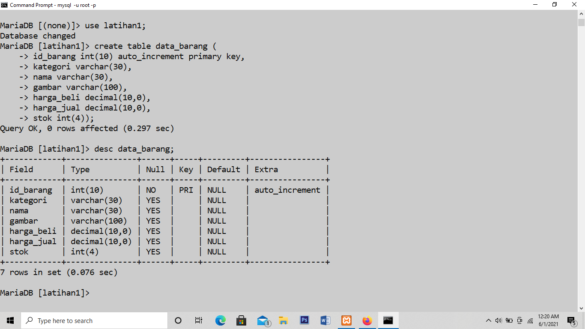
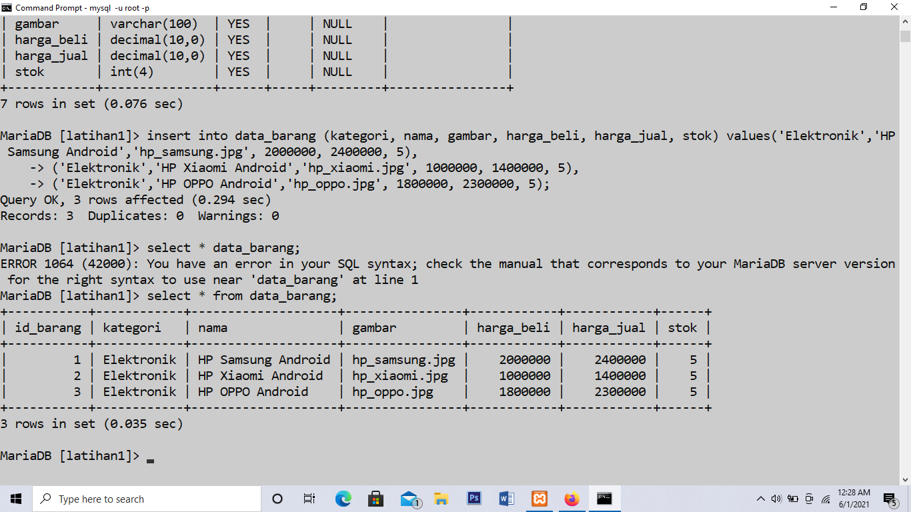
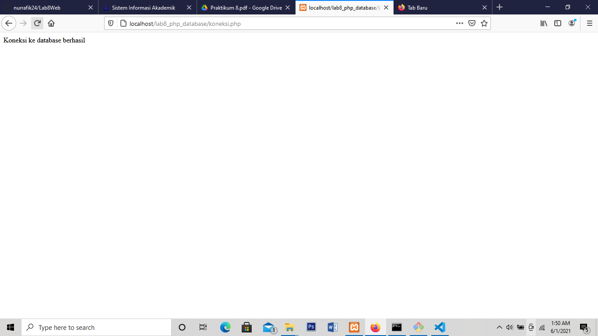
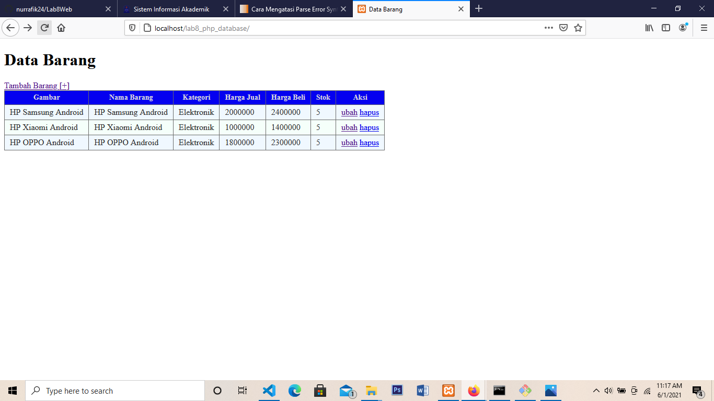
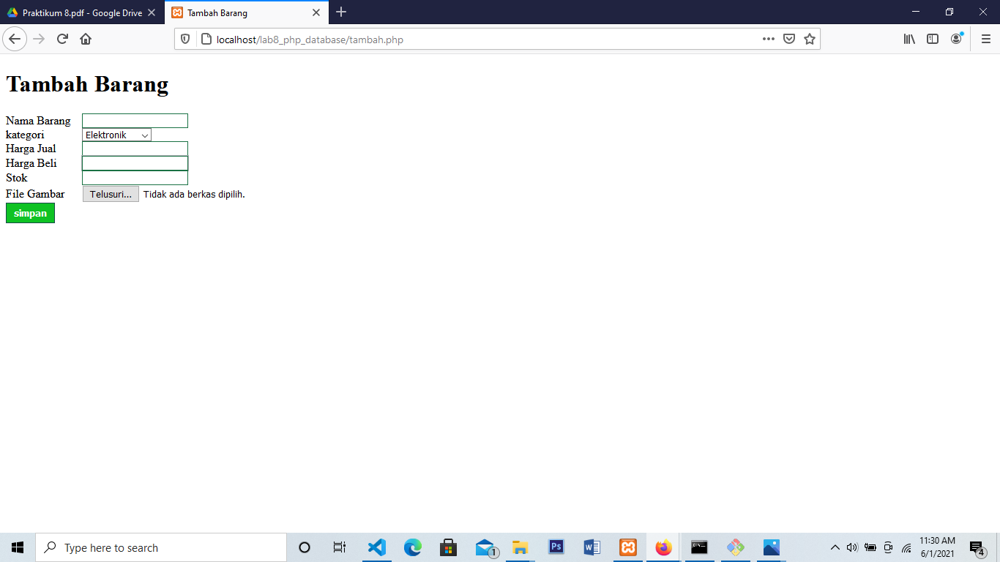
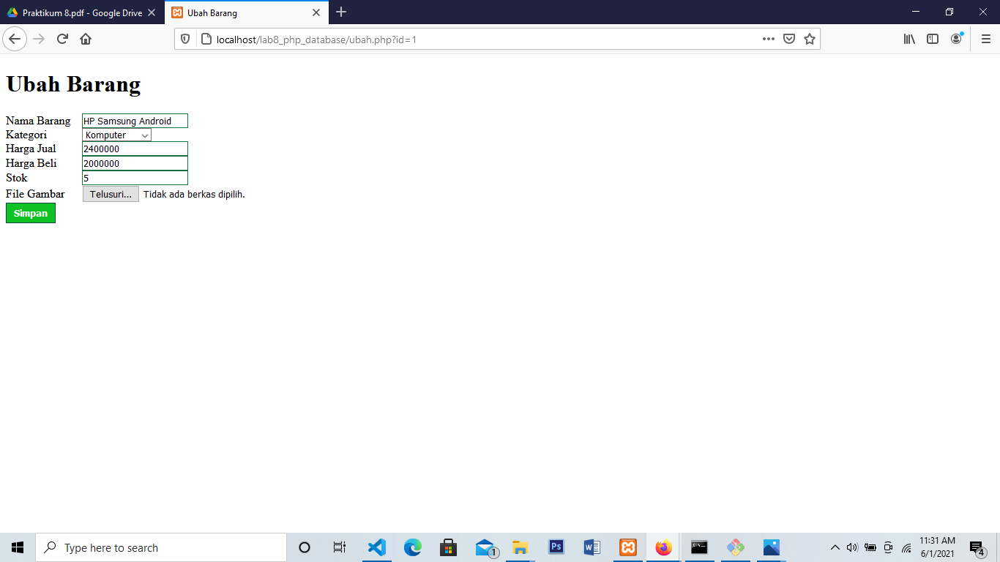
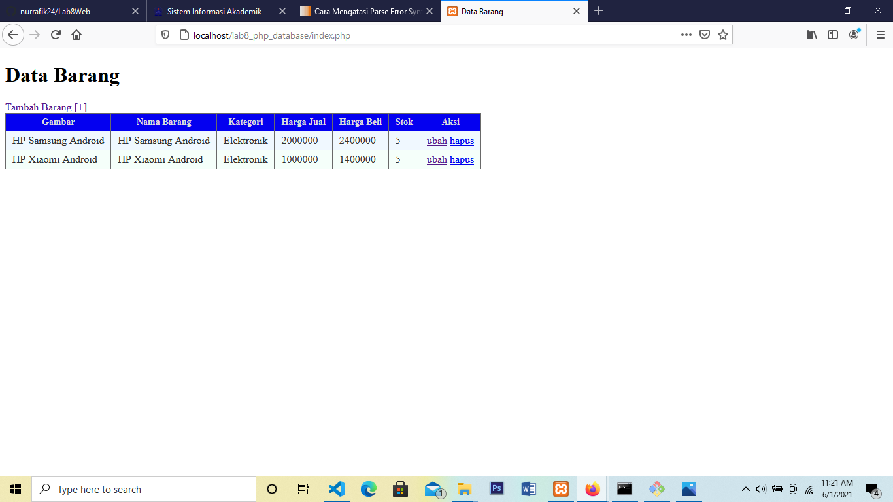

# Lab8Web
# Belajar mengkoneksikan data base

# Membuat data base menggunakan command prompt
berikut tampilannya

menambahkan file database

mengkoneksikan database ke php

menampilkan data base

menambah data

mengubah data

menghapus data
